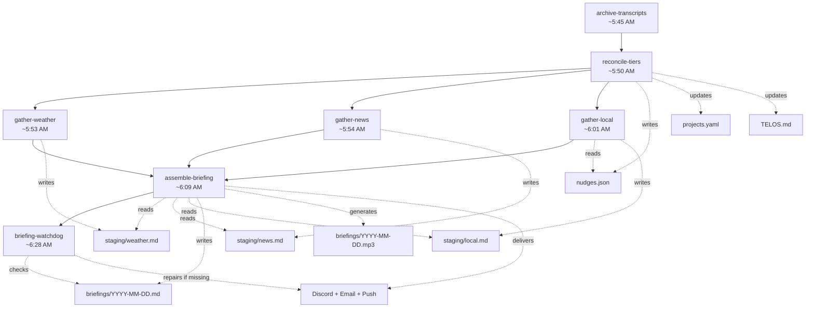

# Briefing Pipeline System

## Quick Reference

| Stage | Task ID | Cron | Time (ET) | Output |
|-------|---------|------|-----------|--------|
| 0 | `archive-transcripts` | `45 5 * * *` | ~5:45 AM | `data/transcripts/{project}/{date}_{time}_{session}.md` |
| 1 | `reconcile-tiers` | `50 5 * * *` | ~5:50 AM | `data/staging/nudges.json`, `data/projects.yaml`, `TELOS.md` |
| 2 | `gather-weather` | `50 5 * * *` | ~5:53 AM | `data/staging/weather.md` |
| 3 | `gather-news` | `50 5 * * *` | ~5:54 AM | `data/staging/news.md` |
| 4 | `gather-local` | `55 5 * * *` | ~6:01 AM | `data/staging/local.md` |
| 5 | `assemble-briefing` | `8 6 * * *` | ~6:09 AM | `data/briefings/YYYY-MM-DD.md`, `.mp3` |
| 6 | `briefing-watchdog` | `25 6 * * *` | ~6:28 AM | Repair + alert (if needed) |

**Delivery channels:** Discord (markdown + MP3), email, push notification (ntfy.sh)

**Staging directory:** `data/staging/` -- transient files consumed and deleted by assembly

**Briefing archive:** `data/briefings/YYYY-MM-DD.md` + `.mp3` -- permanent

---

## Purpose

The briefing pipeline produces a daily morning briefing that combines weather, news, project status, goal tracking, and actionable nudges into a single document. The document is converted to audio (TTS) and delivered across three channels so the user can read or listen during their commute.

The pipeline is fully autonomous. It runs every morning as a sequence of independent Claude Code scheduled tasks. No external cron, no Docker containers, no separate services -- Claude Code itself is the orchestrator and executor.

---

## Core Concepts

### Staged Architecture

The pipeline follows a gather-then-assemble pattern. Each gatherer writes to a staging file independently. The assembler reads all staging files and composes the final briefing. This design means:

- **Partial failure is tolerable.** If one gatherer fails, the assembler still runs with whatever staging files exist.
- **Stages are independently retryable.** A gatherer can be re-run without affecting others.
- **The watchdog provides self-healing.** If the assembler fails, the watchdog attempts recovery 19 minutes later.

### Scheduled Task Execution Model

Each stage is a Claude Code scheduled task (defined in `scheduled-tasks/*.md`). Tasks run unattended via the `mcp__scheduled-tasks` API. Key constraints:

- Tasks run in isolated sessions -- they share no memory or state with each other.
- Tool permissions must be pre-approved in `.claude/settings.local.json`. Unapproved tools silently fail (no error, no output).
- Tasks communicate exclusively through files on disk (staging files, nudges.json, projects.yaml).
- The scheduler applies a small deterministic jitter (up to a few minutes), so listed times are approximate.

### ASCII-Only Output

All pipeline output uses ASCII-safe characters only. No em dashes (use `--`), no curly quotes, no emoji. This prevents encoding issues across Discord, email, and TTS rendering.

---

## Mechanics / Flow

### Pipeline Sequence



### Stage-by-Stage Detail

#### Stage 0: Archive Transcripts (~5:45 AM)

Runs `python scripts/archive_transcripts.py`. Scans all JSONL transcript files under `~/.claude/projects/`, converts new or modified sessions to readable markdown, and organizes by project slug and date. Skips trivial sessions (< 2 messages). Tracked via size+mtime hash in `data/transcripts/index.json`.

This stage has no downstream dependencies in the briefing pipeline. It runs first to archive yesterday's work before the new day's data overwrites session state.

#### Stage 1: Reconcile Tiers (~5:50 AM)

The reconciliation engine updates the 4-tier tracking system. This is the most complex stage, performing eight steps:

1. **Read project registry** -- Parses `data/projects.yaml`
2. **Update health** -- Calculates health (hot/warm/stale/cold) from `last_touched` for active projects. Non-active projects get static health (complete, paused, blocked). Projects without a local `path` or with `environment: separate` get `health: manual`.
3. **Crawl tier-3 tracking files** -- For projects with both `path` and `tracking_file`, reads BACKLOG.md tables or checkbox lists. Counts items by status (open, in progress, blocked, done) and tracks P1 priority items.
4. **Parse capabilities** -- Extracts capability tables from `## Capabilities` sections. Counts linked backlog items per capability.
5. **Autonomous capability promotion** -- Auto-promotes capabilities to "Delivered" when all linked backlog items are complete. Auto-derives the project's current phase from the first "In Progress" capability.
6. **Extract blocked_by from tickets** -- For blocked items with ticket files, reads `**Blocked by**:` lines and flags user-blocked items.
7. **Update last_touched from git** -- Runs `git log -1 --format="%ai"` in each project's repo.
8. **Write projects.yaml** -- Saves updated health, capabilities summary, phase, and last_touched.
9. **Generate nudges** -- Writes `data/staging/nudges.json` with typed recommendations (staleness, capability_blocked, capability_near_complete, phase_complete, delegatable, no_next_action, monthly_review, backlog_blocked, high_priority_open).
10. **Update TELOS Live Pulse** -- Rewrites the `## Live Pulse` section of `TELOS.md` with per-goal project summaries.

**Output:** `data/projects.yaml` (updated), `data/staging/nudges.json`, `TELOS.md` (Live Pulse section)

#### Stage 2: Gather Weather (~5:53 AM)

Fetches the 3-day forecast for {CITY}, {STATE} from the National Weather Service.

**Data source cascade:**
1. **WebFetch (preferred)** -- Fetches `forecast.weather.gov/MapClick.php?CityName={CITY}&state={STATE}&site={NWS_SITE}&textField1={LAT}&textField2={LON}`. Extracts current conditions, 6 forecast periods, temperatures, wind, precipitation, and alerts.
2. **WebSearch (fallback)** -- Searches "weather {CITY} {STATE} today".
3. **Stale cache (last resort)** -- Reuses previous `staging/weather.md` with a `[STALE DATA]` banner.
4. **Unavailable** -- Writes `[WEATHER UNAVAILABLE]` placeholder.

**Output:** `data/staging/weather.md`

Includes an HTML status comment at the end: `<!-- status: success | source: webfetch | timestamp: ... -->`

#### Stage 3: Gather News (~5:54 AM)

Gathers headlines and deep-dive content based on a weekly rotation schedule.

**Daily headlines:** Always gathers the top 10 US and world news headlines with 1-2 sentence summaries and source attribution.

**Weekly deep-dive rotation:**

| Day | Focus Topics |
|-----|-------------|
| Monday | World news + New AI models (parameters, MoE, benchmarks, coding scores) |
| Tuesday | Agentic AI (frameworks, tools, security, industry) |
| Wednesday | Iran/US-Iran war + Ukraine-Russia war |
| Thursday | Cybersecurity (CVEs, threats, tools, policy, breaches) |
| Friday | Weekly rollup of all focus areas |

**Deep-dive depth:** 5-10 paragraphs per topic, targeting 15-20 minutes total reading time.

**Deduplication:** Reads `data/staging/news-history.md` (rolling 5-day log of headlines, source URLs, and one-line summaries). Stories with matching URLs from the last 3 days are skipped unless there is a genuine new development (tagged `[UPDATE]`).

**Incremental writes:** After each successful WebSearch, results are immediately appended to the output file. If a later search hangs, earlier results are preserved.

**History update:** After gathering, appends today's entries to `news-history.md` and prunes entries older than 5 days.

**Output:** `data/staging/news.md`, `data/staging/news-history.md` (updated)

Status comment: `<!-- status: success | topics_found: N | stories_new: N | stories_updated: N | timestamp: ... -->`

#### Stage 4: Gather Local (~6:01 AM)

Reads local files only -- no web searches. Composes project status, goal progress, nudges, and shopping reminders.

**Files read:**
- `data/projects.yaml` -- statuses, next actions, due dates
- `TELOS.md` -- goals and Live Pulse
- `data/changelog.md` -- recent project status changes
- `data/shopping-list.md` -- current shopping list
- `data/staging/nudges.json` -- reconciliation-generated nudges

**Output sections:**
- **Project Updates** -- Changelog entries since yesterday
- **Goal Progress & Deadlines** -- Per-TELOS-goal project summaries with health, days since touch, due dates, next actions. Flags items > 7 days with WARNING, flags overdue or due-within-7-days items.
- **Nudges & Recommendations** -- The `recommendation` field as lead item, then grouped nudges (deadlines first, then staleness, delegatable, other)
- **Shopping Reminder** -- Count of unchecked items or "empty" notice

**Output:** `data/staging/local.md`

#### Stage 5: Assemble Briefing (~6:09 AM)

Reads all three staging files, checks for staleness, composes the final briefing, generates audio, and delivers.

**Assembly steps:**
1. **Read staging files** -- weather.md, news.md, local.md. Missing files noted but do not block assembly.
2. **Check staleness** -- Parses the `<!-- status: ... -->` comment in each file. Timestamps > 24 hours old get a `[STALE DATA]` banner.
3. **Compose briefing** -- Combines into `data/briefings/YYYY-MM-DD.md` with sections: Date & Weather, Top 10 Headlines, Deep-Dive Focus, Project Updates, Goal Progress & Deadlines, Nudges & Recommendations, Shopping Reminder.
4. **Generate TTS** -- Runs `python scripts/generate_tts.py` on the briefing file. Produces `.mp3` alongside `.md`. Failure is non-fatal.
5. **Deliver** -- Sends via all three channels (see Delivery below).
6. **Clean up staging** -- Deletes weather.md, news.md, local.md from staging.

**Output:** `data/briefings/YYYY-MM-DD.md`, `data/briefings/YYYY-MM-DD.mp3`

#### Stage 6: Briefing Watchdog (~6:28 AM)

Verifies the briefing was delivered. If not, diagnoses and attempts repair.

**Verification:** Checks if `data/briefings/YYYY-MM-DD.md` exists and is > 500 bytes. If yes, reports success and stops.

**Diagnosis:** Classifies each staging file as OK, MISSING, or STALE based on existence, size (> 100 bytes), and today's timestamp.

**Repair cases:**

| Case | Condition | Action |
|------|-----------|--------|
| A | All staging files present, briefing missing | Re-assemble from staging, deliver with `[RECOVERED]` tag |
| B | Some staging files present | Assemble partial briefing with placeholders, deliver with `[PARTIAL]` tag, alert which gatherers failed |
| C | All staging files missing | Attempt quick WebSearch for weather + read local files, deliver with `[MINIMAL]` tag. If even that fails, send push alert only. |

---

## Data Schemas

### Staging File: weather.md

```markdown
## Weather -- {CITY}, {STATE}

[Current conditions: temp, sky, wind, humidity]

[Active alerts if any]

| Day | High/Low | Conditions |
|-----|----------|------------|
| Today | HH/LL | Description |
| Tomorrow | HH/LL | Description |
| Day After | HH/LL | Description |

<!-- status: success | source: webfetch | timestamp: YYYY-MM-DDTHH:MM:SS -->
```

### Staging File: news.md

```markdown
## Top 10 Headlines

1. **Headline** -- Summary. (Source)
2. ...

## Deep Dive -- [Today's Focus Topic]

[5-10 paragraphs per topic]

<!-- status: success | topics_found: N | stories_new: N | stories_updated: N | timestamp: YYYY-MM-DDTHH:MM:SS -->
```

### Staging File: local.md

```markdown
## Project Updates

[Changelog entries or "No project changes since yesterday."]

## Goal Progress & Deadlines

[Per-TELOS-goal breakdown]

## Nudges & Recommendations

[Recommendation + grouped nudges]

## Shopping Reminder

[Item count or "Shopping list is empty."]

<!-- status: success | timestamp: YYYY-MM-DDTHH:MM:SS -->
```

### Staging File: nudges.json

```json
{
  "generated": "YYYY-MM-DDTHH:MM:SS",
  "recommendation": "Single highest-value next action string",
  "nudges": [
    {
      "type": "staleness | capability_blocked | capability_near_complete | phase_complete | delegatable | no_next_action | monthly_review | backlog_blocked | high_priority_open",
      "project": "project-slug",
      "message": "Human-readable nudge text"
    }
  ],
  "status": "success",
  "timestamp": "YYYY-MM-DDTHH:MM:SS"
}
```

### Staging File: news-history.md

Rolling 5-day deduplication log. Pruned each morning by gather-news.

```markdown
# News History (Rolling 5-day deduplication log)

## YYYY-MM-DD
- HEADLINE | source_url | one-line summary
- HEADLINE | source_url | one-line summary

## YYYY-MM-DD (older)
...
```

### Final Briefing: data/briefings/YYYY-MM-DD.md

```markdown
# Morning Briefing -- Month DD, YYYY

---

## Date & Weather
[3-day forecast table, alerts]

---

## Top 10 Headlines
[Numbered list with bold headlines, summaries, sources]

---

## Deep-Dive Focus -- [Topic] ([Day])
[5-10 paragraphs per topic]

---

## Project Updates
[Changelog or "no changes"]

---

## Goal Progress & Deadlines
[Per-TELOS-goal with project status, health, due dates, next actions]

---

## Nudges & Recommendations
[Recommendation lead, then deadline alerts, high-priority items, blocked items, delegatable items]

---

## Shopping Reminder
[Count or empty]

---

*Generated: YYYY-MM-DD | Sources: NWS (weather), WebSearch (news), local files (tasks/projects)*
```

---

## System Integration

### Delivery Channels

All delivery happens in the assemble-briefing stage (or watchdog recovery). Three channels fire independently -- failure of one does not block others.

**Discord:**
```bash
python scripts/send_discord.py --title "Morning Briefing -- Month DD, YYYY" \
  --file data/briefings/YYYY-MM-DD.md \
  --attach data/briefings/YYYY-MM-DD.mp3
```
Sends the full markdown as message content (chunked if needed) with the MP3 as an attachment. The `--file` flag is required -- passing the path as a positional argument sends the path string as the message text instead of the file contents.

**Email:**
```bash
python scripts/send_email.py --subject "Morning Briefing -- Month DD, YYYY" \
  --body-file data/briefings/YYYY-MM-DD.md
```
Gmail SMTP via App Password. Credentials in `.env` (SMTP_USER, SMTP_PASS, SMTP_TO).

**Push notification:**
```bash
bash scripts/send_push.sh "Morning Briefing ready -- [1-line summary]"
```
ntfy.sh push to the user's mobile device. Topic in `.env` (NTFY_TOPIC).

### TTS Audio Generation

```bash
python scripts/generate_tts.py data/briefings/YYYY-MM-DD.md
```

Uses Microsoft Edge TTS (`edge-tts` Python package). Converts markdown to speech-friendly text by stripping formatting (headers, bold, links, code blocks, tables), then generates an MP3 file saved alongside the markdown. Default voice: `en-US-GuyNeural`. The output includes speech preprocessing to handle abbreviations, numbers, and technical terms.

TTS failure is non-fatal -- the text briefing is delivered without the audio attachment.

### Tool Permission Requirements

Scheduled tasks run unattended. Tools not pre-approved in `.claude/settings.local.json` silently fail. Required permissions:

| Stage | Tools Used |
|-------|-----------|
| archive-transcripts | Bash (python), Read, Write |
| reconcile-tiers | Read, Write, Bash (git commands) |
| gather-weather | WebFetch, WebSearch (fallback), Read, Write |
| gather-news | WebSearch, Read, Write |
| gather-local | Read, Write |
| assemble-briefing | Read, Write, Bash (TTS + delivery scripts) |
| briefing-watchdog | Read, Write, Bash (delivery scripts), WebSearch (Case C recovery) |

Write permissions specifically require: `Write({PROJECT_ROOT}/data/**)`.

### Upstream Dependencies

- **projects.yaml** -- Source of truth for project health, status, next actions, due dates. Updated by reconcile-tiers, consumed by gather-local.
- **TELOS.md** -- Goal definitions and Live Pulse. Updated by reconcile-tiers, consumed by gather-local.
- **config.yaml** -- Weather location, news topics, weekly focus schedule, delivery channel settings. Read by gather-weather, gather-news, assemble-briefing.
- **.env** -- Secrets (SMTP_USER, SMTP_PASS, SMTP_TO, NTFY_TOPIC, NTFY_SERVER, DISCORD_WEBHOOK). Read by delivery scripts at runtime.

### On-Demand Briefing

The `/briefing` slash command generates a briefing interactively using the same data sources but without the staged pipeline. It gathers weather, news, and local data in a single session and delivers immediately. The on-demand path does not write staging files or clean up after itself.

---

## File References

### Scheduled Task Prompts (Source of Truth)

| File | Description |
|------|-------------|
| `scheduled-tasks/archive-transcripts.md` | Transcript archival prompt |
| `scheduled-tasks/reconcile-tiers.md` | 4-tier reconciliation engine prompt |
| `scheduled-tasks/gather-weather.md` | Weather gatherer prompt |
| `scheduled-tasks/gather-news.md` | News gatherer prompt |
| `scheduled-tasks/gather-local.md` | Local data gatherer prompt |
| `scheduled-tasks/assemble-briefing.md` | Assembly and delivery prompt |
| `scheduled-tasks/briefing-watchdog.md` | Verification and repair prompt |

### Helper Scripts

| File | Purpose | Usage |
|------|---------|-------|
| `scripts/send_discord.py` | Discord webhook delivery | `python scripts/send_discord.py --title "T" --file f.md --attach f.mp3` |
| `scripts/send_email.py` | Gmail SMTP delivery | `python scripts/send_email.py --subject "S" --body-file f.md` |
| `scripts/send_push.sh` | ntfy.sh push notification | `bash scripts/send_push.sh "Message"` |
| `scripts/generate_tts.py` | Edge TTS audio generation | `python scripts/generate_tts.py briefing.md` |
| `scripts/archive_transcripts.py` | Session transcript archival | `python scripts/archive_transcripts.py` |

### Data Files

| File | Role | Lifetime |
|------|------|----------|
| `data/staging/weather.md` | Weather staging | Transient -- deleted after assembly |
| `data/staging/news.md` | News staging | Transient -- deleted after assembly |
| `data/staging/local.md` | Local data staging | Transient -- deleted after assembly |
| `data/staging/nudges.json` | Reconciliation nudges | Persists until next reconcile run |
| `data/staging/news-history.md` | 5-day dedup log | Rolling -- pruned daily |
| `data/staging/weather-diag.txt` | Weather task diagnostic | Overwritten each run |
| `data/briefings/YYYY-MM-DD.md` | Final briefing | Permanent archive |
| `data/briefings/YYYY-MM-DD.mp3` | TTS audio | Permanent archive |
| `data/config.yaml` | Pipeline configuration | Manual edits only |
| `data/projects.yaml` | Project registry | Updated by reconcile-tiers |

---

## Edge Cases and Limitations

### Machine Asleep or Off

If the machine is powered off or asleep during the pipeline window (5:45-6:28 AM), all tasks miss their cron triggers. The scheduler may fire missed tasks on wake, but timing gaps can cause the assembler to run before gatherers finish. The watchdog provides the safety net: it checks at ~6:28 AM and attempts recovery regardless of what the earlier stages did.

### Tool Permission Failures

The most common failure mode. If a new tool is used in a task prompt but not pre-approved in `.claude/settings.local.json`, the tool call silently produces no output. The task continues running but with missing data. Symptoms: staging files are written but empty or truncated, or delivery scripts never fire. Diagnosis: check which tools the failing task needs and audit the allow list.

### WebSearch / WebFetch Failures

Web tools can fail due to rate limits, network issues, or API changes. Each gatherer has its own fallback chain:
- **Weather:** WebFetch -> WebSearch -> stale cache -> unavailable placeholder
- **News:** Failed searches get one retry, then `[Topic unavailable]` placeholder

The assembler tolerates missing staging files. The watchdog tolerates missing staging files and attempts its own web searches as a last resort.

### Stale Data Detection

Each staging file includes a `<!-- status: ... | timestamp: ... -->` comment. The assembler checks timestamps and prepends `[STALE DATA]` to sections older than 24 hours. This catches cases where a staging file exists from a previous day but was not refreshed.

### News Deduplication Drift

The news-history.md file is pruned to 5 days. If gather-news fails for multiple consecutive days, the history file may lose context and begin repeating stories when it resumes. The `[UPDATE]` tagging also depends on LLM judgment about whether a development is "genuinely new," which can occasionally miss or over-tag.

### TTS Quality

Edge TTS handles prose well but struggles with abbreviations, URLs, table formatting, and technical terms. The `generate_tts.py` script includes preprocessing to strip markdown formatting and handle common patterns, but unusual content may produce awkward audio. TTS failure is always non-fatal.

### Concurrent Task Execution

Stages 2-4 (weather, news, local) share similar cron expressions and may run concurrently. They write to different files and read different sources, so there is no contention. However, gather-local reads `nudges.json` which is written by reconcile-tiers -- if reconcile-tiers runs long, gather-local may read stale or missing nudges. The 6-11 minute gap between reconcile-tiers (5:50) and gather-local (6:01) provides buffer.

### Watchdog as Single Point

The watchdog is the last automated check. If it also fails (tool permission, session crash), no briefing is delivered and no alert is sent. Manual recovery via `/briefing` is the final fallback.

### Discord Message Length

Discord has a 2000-character message limit. The `send_discord.py` script chunks long messages automatically. Very long briefings (especially Friday rollups) may arrive as 4-6 sequential Discord messages, which can be harder to read on mobile.

---

## Revision History

| Date | Change |
|------|--------|
| 2026-04-09 | Initial version documenting the morning briefing pipeline |
